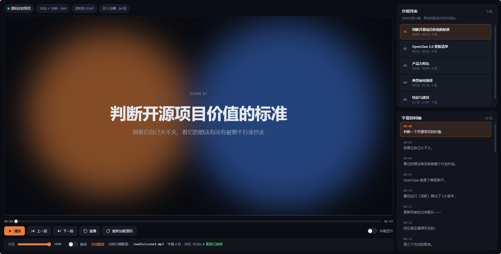

# Malinton Video Studio

一个轻量、通用的**分镜视频预览工作台**。只要你的合成页面能响应实时定位，就能在浏览器里得到一套带分镜列表、字幕时间轴、音频控制的编辑器界面。

不绑定任何渲染框架——Remotion、纯 HTML/CSS 动画、Canvas，甚至已经渲染好的 mp4 都能接进来。



## 特性

- **分镜列表** — 点击任意分镜跳转到对应时间段，播放时自动跟随高亮
- **字幕时间轴** — 逐句展示时间戳，点击定位，当前句逐帧高亮
- **实时源码预览** — iframe 加载你的合成页面，通过 `postMessage` 协议驱动播放与定位
- **精确的时间轴控制** — 播放 / 暂停、上一段 / 下一段、重播、进度条拖拽、键盘左右键
- **音频控制** — 音量与静音，支持「每个分镜一段配音」或「整片一条音轨」
- **单一数据源** — 分镜、字幕、配音和播放器配置都写在一份 JSON 清单里
- **零框架耦合** — 只要你的合成页面能响应 seek 消息，就能接进来
- **可换肤** — 全部颜色都是 `.mvs-root` 上的 CSS 变量

## 应用示例

- **[码灵通视频生成](https://chat.malingtong.com/)** — 用 AI 生成口播视频，分镜、字幕和配音由 studio 统一预览与试听。

## 安装

```bash
npm install -D malinton-video-studio
```

## 快速开始

### 1. 写一份清单

在项目根目录创建 `malinton.studio.json`：

```json
{
  "title": "我的视频",
  "meta": { "width": 1920, "height": 1080, "frameRate": 30 },
  "preview": { "type": "html", "src": "composition/index.html" },
  "audio": "audio/voiceover.mp3",
  "scenes": [
    { "title": "开场", "start": 0, "end": 10 },
    { "title": "正片", "start": 10, "end": 36 }
  ],
  "subtitles": [
    { "start": 0, "text": "第一句字幕。" },
    { "start": 2.5, "text": "第二句字幕。" }
  ]
}
```

所有时间单位都是**秒**。`preview.src` 与 `audio` 等路径都相对于 CLI 的 `--root`，也就是被服务的项目根目录。

### 2. 启动

```bash
npx malinton-studio --root .
```

浏览器会自动打开 `http://localhost:3000`。清单会自动在根目录下查找，也可以在任意位置用 `--manifest <file>` 指定。

### 3. 让合成页面响应播放控制

studio 会向 iframe 发送消息来驱动画面。只要监听这三条消息，就能获得逐帧精确的定位：

```js
window.addEventListener('message', (event) => {
  const { type, time, frame, frameRate } = event.data ?? {}
  switch (type) {
    case 'malinton-studio:seek':  render(time, frame); break  // 定位到某一刻
    case 'malinton-studio:play':  render(time, frame); break  // 开始播放
    case 'malinton-studio:pause': break                       // 暂停
  }
})

// 页面就绪后知会 studio，让它把第一帧推过来
parent.postMessage({ type: 'malinton-studio:ready' }, '*')
```

`time` 是秒，`frame` 是 `time × frameRate` 取整，按帧渲染时直接用 `frame` 更省事。

关键点：**画面应当由 `time` / `frame` 推导出来（声明式渲染），而不是自己计时**。这样拖拽进度条才能精确落帧。

完整可运行的版本见 [examples/basic/composition/index.html](examples/basic/composition/index.html)。

## CLI

```
malinton-studio [root] [options]

  -r, --root <dir>       要服务的项目根目录          (默认: 当前目录)
  -m, --manifest <file>  清单路径，相对于 root
  -p, --port <number>    监听端口                    (默认: 3000)
      --host <host>      绑定地址                    (默认: localhost)
      --no-open          不自动打开浏览器
  -h, --help             显示帮助
```

不传 `--manifest` 时，会在 `--root` 下依次查找 `malinton.studio.json`、`studio.config.json`、`studio.json`。

`--root` 下的静态资源会被直接服务，所以合成页面可以用相对路径引用音频、图片、脚本。静态文件走 HTTP Range（`206 Partial Content`），`<audio>` / `<video>` 才能正常定位播放。

## 作为 React 组件使用

不需要 CLI 时，把 `<Studio>` 直接挂进你自己的应用：

```tsx
import { Studio } from 'malinton-video-studio'
import 'malinton-video-studio/style.css'
import manifest from './malinton.studio.json'

export default function App() {
  return (
    <Studio
      manifest={manifest}
      resolveAsset={(p) => new URL(`./assets/${p}`, import.meta.url).href}
      autoPlay
    />
  )
}
```

### `<Studio>` 属性

| 属性 | 类型 | 说明 |
| --- | --- | --- |
| `manifest` | `StudioManifest` | **必填**，时间轴数据 |
| `driver` | `PreviewDriver` | 自定义预览驱动，见「自定义预览源」。不传则按 `manifest.preview` 用内置 iframe 驱动 |
| `resolveAsset` | `(path: string) => string` | 把清单里的相对路径转成可加载的 URL，默认原样返回 |
| `autoPlay` | `boolean` | 挂载后自动播放，默认 `false` |
| `className` | `string` | 根元素附加类名，用于覆盖样式 |

## 清单字段

CLI 读取的 JSON 和 `<Studio manifest>` 用的是同一套结构。

| 字段 | 类型 | 说明 |
| --- | --- | --- |
| `title` | `string` | 项目标题，同时用作浏览器标签页标题 |
| `meta.width` / `meta.height` | `number` | 画布尺寸，默认 `1920 × 1080`。同时决定预览区的锁定比例 |
| `meta.aspectRatio` | `string` | 画幅标签，默认从宽高自动约分得出 |
| `meta.resolutionLabel` | `string` | 清晰度标签，默认按长边推导（`2K`、`4K`…），可手动覆盖 |
| `meta.frameRate` | `number` | 帧率，默认 `30`。按帧驱动的预览（如 Remotion）必须与合成一致 |
| `meta.sourceLabel` | `string` | 预览区左上角的状态文字，默认 `源码实时预览` |
| `preview` | `object` | 预览源，见下表。不配置则只显示右侧面板 |
| `audio` | `string` | 整片音轨，当某个分镜没有自己的 `audio` 时回退到它 |
| `duration` | `number` | 总时长覆盖值，默认取最后一个分镜/字幕的结束时间 |
| `scenes[]` | `Scene[]` | 分镜列表 |
| `subtitles[]` | `Subtitle[]` | 字幕列表 |

### `preview`

| 形态 | 说明 |
| --- | --- |
| `{ "type": "html", "src": "composition/index.html" }` | 把合成页面加载进 iframe，用 `postMessage` 驱动 |
| `{ "type": "video", "src": "out/video.mp4" }` | 直接播放渲染好的产物 |
| `{ "type": "none" }` | 不显示画布，只用右侧的分镜与字幕面板 |

省略 `preview` 等同于 `{ "type": "none" }`。`type` 省略时按 `html` 处理。`html` 形态还可以给 `sandbox` 覆盖 iframe 的沙箱属性。

### `scenes[]`

| 字段 | 类型 | 说明 |
| --- | --- | --- |
| `title` | `string` | **必填**，分镜标题 |
| `start` | `number` | **必填**，起始时间（秒） |
| `end` | `number` | 结束时间。省略时取下一个分镜的 `start`，最后一个取 `duration` |
| `description` | `string` | 可选的一行说明 |
| `index` | `string` | 序号标签，默认按顺序补零为 `01`、`02`… |
| `audio` | `string` | 该分镜的配音，优先级高于顶层 `audio` |
| `id` | `string` | 稳定标识，默认 `scene-{下标}` |

### `subtitles[]`

| 字段 | 类型 | 说明 |
| --- | --- | --- |
| `text` | `string` | **必填**，字幕文本 |
| `start` | `number` | **必填**，起始时间（秒） |
| `end` | `number` | 结束时间，默认取下一句的 `start` |
| `id` | `string` | 稳定标识，默认 `cue-{下标}` |

所有时间单位都是**秒**。`resolveManifest()` 会补全默认值、推导 `id` 与序号，并按 `start` 重新排序，所以清单可以写得很随意——只有 `title`、`start`、`text` 这类语义字段是必填的。

**音频与字幕都是可选的。** 不写 `audio` 就只是没有声音，音量控件会置灰；不写 `subtitles` 就只显示分镜列表。

音频路径同样相对于 `--root`。如果用 CLI 启动，内置服务器已经支持 Range 请求，音频可以正常定位。**若你自己起服务器托管 studio，务必让它响应 `Range: bytes=` 并返回 `206`** —— 否则浏览器会认为音频不可寻址（`audio.seekable` 为空），`currentTime` 会被钳回 0，表现为播放器和音频状态永远对不上。

## 换肤

所有视觉变量都挂在 `.mvs-root` 上，覆盖即可：

```css
.mvs-root {
  --mvs-bg: #0b0d12;
  --mvs-surface: #12151d;
  --mvs-accent: #e8813a;      /* 主色，用于播放按钮与高亮 */
  --mvs-text: #e6e9f0;
  --mvs-ok: #4ade80;          /* 状态点 */
  --mvs-radius: 12px;
}
```

## 与 Remotion 的关系

这个包**不依赖 Remotion**——`remotion` / `@remotion/player` 都不在依赖里，你不想用就完全用不到。

如果你在用 Remotion，接法取决于你要「预览」还是「渲染」：

### 渲染后预览

最省事：渲染出 mp4 后，把清单的 `preview` 指向一个播放该文件的页面，或直接用 `{ "type": "video", "src": "out/video.mp4" }`。

### 直接驱动 Remotion Player（推荐）

**不要试图嵌入 Remotion Studio。** Studio 是 Remotion 自己的编辑器外壳，没有对外的 seek 接口，嵌进 iframe 后进度条只能看不能拖。

能逐帧定位的是 `@remotion/player`，它暴露命令式的 `seekTo(frame)`。studio 的 `driver` 属性就是为这种情况留的口子——把 player 句柄适配成 `PreviewDriver`，清单仍从 `malinton.studio.json` 读：

```tsx
import { createElement, useRef } from 'react'
import { Player, type PlayerRef } from '@remotion/player'
import type { PreviewDriver } from 'malinton-video-studio'

export function useRemotionDriver({ durationInFrames, fps, width, height }) {
  const playerRef = useRef<PlayerRef>(null)
  // player 挂载前 setVolume 会被丢掉，先存起来，等第一次 seek 再补上
  const wantVolume = useRef<{ volume: number; muted: boolean } | null>(null)
  const volumeApplied = useRef(false)

  const applyVolume = () => {
    const want = wantVolume.current
    const player = playerRef.current
    if (!want || !player) return
    player.setVolume(want.volume)
    if (want.muted) player.mute()
    else player.unmute()
    volumeApplied.current = true
  }

  return useRef<PreviewDriver>({
    isReady: () => !!playerRef.current,
    seek: ({ frame }) => {
      playerRef.current?.seekTo(frame)
      if (!volumeApplied.current) applyVolume()  // 补齐挂载期间漏掉的音量
    },
    play: ({ frame }) => {
      playerRef.current?.play()   // 唤醒 AudioContext，启动合成内的 <Audio>
      playerRef.current?.pause()  // 立刻按停，别让 player 自己的时钟跑起来
      playerRef.current?.seekTo(frame)
    },
    pause: ({ frame }) => { playerRef.current?.pause(); playerRef.current?.seekTo(frame) },
    reload: () => playerRef.current?.seekTo(0),
    // 合成里的 <Audio> 归 player 管，音量滑块必须转发过去才有作用
    setVolume: (volume, muted) => {
      wantVolume.current = { volume, muted }
      if (playerRef.current) applyVolume()
      else volumeApplied.current = false
    },
    render: () => createElement(Player, {
      ref: playerRef,
      component: MyComposition,
      durationInFrames, fps,
      compositionWidth: width, compositionHeight: height,
      controls: false,       // 关键：时钟归 studio，别让 player 自己跑
      clickToPlay: false,
      style: { width: '100%', height: '100%' },
    }),
  }).current
}
```

然后把它和清单一起交给 `<Studio>`：

```tsx
import manifest from './malinton.studio.json'

<Studio manifest={manifest as StudioManifest} driver={driver} />
```

两条约束必须满足，否则画面和进度条会对不上：

1. 清单里的 `meta.frameRate` 要等于合成的 `fps`（默认 30）。
2. 清单的总时长要等于 `durationInFrames / fps`。

完整可运行的版本见 [examples/remotion](examples/remotion)。

### 为什么 `play()` 和 `pause()` 都要调

`PlayerRef.play()` 不只是开始播放，它还会**恢复共享的 AudioContext**；`pause()` 则会挂起它。这是个容易踩的坑：

- 只调 `pause()` 不调 `play()` → AudioContext 从第一帧起就被挂起且永不恢复，**合成里的 `<Audio>` 全程静音**，而画面看起来完全正常。
- 只调 `play()` 不调 `pause()` → player 自己的时钟跑起来，和 studio 的时钟互抢，画面跑到进度条前面。

所以播放时是「`play()` → `pause()` → `seekTo(frame)`」：唤醒音频、立刻按停、再定位到目标帧。player 只当渲染器用，时钟始终归 studio。

### 为什么 `controls={false}` 是必须的

studio 拥有唯一的播放时钟，每一帧都通过 `driver.seek({ time, frame })` 推给预览。如果放任 player 自己播放，两套时钟会互相争夺画面，表现为拖拽不准、播放抖动。让 player 只做「按帧渲染」，定位就是精确的。

## 自定义预览源

`driver` 是一个很小的接口，任何能「渲染任意时刻」的东西都能接进来——Canvas、WebGL、Lottie、已经渲染好的视频：

```ts
interface PreviewDriver {
  /** 渲染某个确切时刻。每次 seek 和每个播放帧都会调用。 */
  seek(frame: DriverFrame): void
  play?(frame: DriverFrame): void
  pause?(frame: DriverFrame): void
  /** 「重新加载源码」按钮。 */
  reload?(): void
  /**
   * 把播放器的音量与静音状态交给真正发声的那一端。
   *
   * 只有自己持有音频的渲染器才需要实现。清单里的音频由 studio 自己的
   * `<audio>` 元素播放，控件直接作用其上；但 `@remotion/player` 这类
   * 渲染器的声音来自合成内部的 `<Audio>`，studio 够不着——没有这个钩子，
   * 音量滑块会看起来完全失灵。
   *
   * 值变化时调用一次，驱动挂载时也会调用一次以应用初始状态。
   */
  setVolume?(volume: number, muted: boolean): void
  /** 挂载到画布区域，可返回 iframe / Player / canvas。 */
  render?(): ReactNode
  /** 返回 false 时 studio 会跳过推帧，等它就绪。 */
  isReady?(): boolean
  /**
   * 释放 React 之外挂的资源——window 监听器、observer、定时器。
   * 驱动被替换或卸载时调用。
   */
  dispose?(): void
}

interface DriverFrame {
  time: number      // 秒
  frame: number     // time × frameRate，取整
  frameRate: number
  duration: number
}
```

几点实现上的注意：

- **`seek` 必须由传入的 `frame` 推导画面**，不要自己计时，否则拖拽会漂移。
- **`render()` 里别写内联的 `ref` 回调**。React 在 ref 身份变化时会先用 `null` 调一次旧的，跟真正的卸载无法区分——如果在那里重置了就绪标记，后续的 seek 会被静默丢掉。用稳定的函数引用。
- **`isReady()` 返回 false 时 seek 会被跳过**，所以它只该反映「现在能不能画」，不要用它表达其他状态。
- **自己持有音频就实现 `setVolume`**。否则音量滑块只对清单音轨有效，对合成内部的 `<Audio>` 无效——而用户拖滑块时预期声音一定变小，不该让他去分辨「这个滑块管哪类音源」。置灰判断也由此而来：只要驱动实现了 `setVolume`，控件就是可用的。

不传 `driver` 时，studio 会按 `manifest.preview` 选中内置实现：`html` → iframe 驱动，指向 `preview.src`；`video` → `<video>`。这两个也都在 `src/drivers/` 里，可以直接参考。

## 本地开发

```bash
npm install
npm run build     # 构建库 + host shell
npm run example   # 用 examples/basic 启动
npm run typecheck
```

## License

MIT
